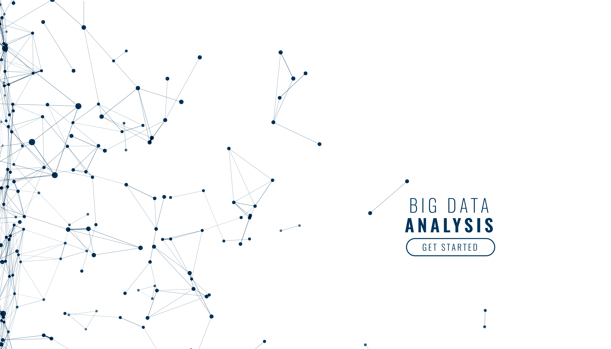

  

# 👋 Patrick Egon | Data Scientist

### 💡 About Me

Data Scientist with over 10 years of experience transforming complex datasets into impactful solutions using advanced analytical techniques. Proven expertise in Data Analysis, ETL, and a robust technical skillset.

## 🚀 Expertise

Machine Learning, ETL Pipelines, Linux and Statistical Analysis.

📍 **Porto, Portugal** | 📧 [patrick.egon@gmail.com](mailto:patrick.egon@gmail.com) | 🔗 [LinkedIn](https://linkedin.com/in/patrick-egon-santos) | 👨‍💻 [GitHub](https://github.com/patrickegon) 

### 🛠️ Tech Stack

  
  
  
  
  

---
## 💼 Experience

**Freelance Data Analyst & Scientist** | _Jan 2022 – Present_

* Delivered **actionable data insights** across diverse industries, improving operational efficiency.
* Managed **end-to-end data projects**: acquisition, processing, modeling, visualization.
* Proficient in **ETL (Python/SQL/Bash/R)**, statistical modeling (**R**), and data visualization (**R**).
* Implemented **process automation (Python/APIs)**, saving analysis time.

**Biodiversity and Data Researcher @ University of Porto (CIIMAR/FCUP)** | _Jan 2019 – 2023_

Built upon research-focused internships at Evandro Chagas Institute (CIT/IEC) (2013-2015).

* **Arctic Climate Change Analysis:** Evaluated impact on microorganism diversity, identifying outbreak risks.
* **Microbial Community Mapping (ML):** Mapped distribution and correlations using ML models.
* **Automated Climate Data Pipelines (Bash/R/Python):** Generated climate impact insights via automated ML/statistical analysis.
* **+20% Workflow Efficiency:** Optimized data workflows (transformation, filtering, visualization).
* **Strategic Biodiversity Reports:** Informed Arctic biodiversity and policy decisions.

**Junior Data Analyst (High-achieving Scholarship) @ Evandro Chagas Institute**

_Jun 2015 – Jul 2016_
* Led full lifecycle data analysis (ETL) for Yellow Fever virus impact study.
* Predicted outbreak patterns and live-fire scenarios using statistical/ML models (Python/Shell).
* Identified data analysis improvements and delivered strategic reports, providing big data insights to stakeholders.
* Developed ETL processes and predictive models within Data Engineering.
* Applied deep learning to pinpoint novel Yellow Fever strain distribution in the Americas.

_Jun 2014 – Jul 2015_
* Spearheaded data analysis (ETL in Python/Bash) on viral impact on Rabies and bat diseases using metabarcoding and ML.
* Detected endemic outbreak patterns via statistical and predictive modeling.
* Proposed data analysis enhancements and generated strategic reports.

---
### 🎓 Education

* **MSc in Biodiversity, Genetics and Evolution**, University of Porto, Portugal
* **BSc in Natural Sciences**, Pará State University, Brazil

### 📜 Certifications

* **FreeCodeCamp:** Data Analysis with Python (2025)
* **LNCC:** Big Data (2016)
* **LNCC:** Data Analysis (2016)
* **LNCC:** Network Sciences (2016)
* **LNCC:** Big Data Management (2016)
* **Evandro Chagas Institute:** Introduction to Shell Scripting (2015)
* **Evandro Chagas Institute:** Introduction to Linux (2015)
* **Evandro Chagas Institute:** Fundamentals of Phylogenetic Analyses and Phylogeography (2015)

---

### 🤝 Let's Connect!

I'm always open to discussing innovative ideas, potential collaborations, and exciting opportunities in Data Science and AI. Feel free to reach out!
---
